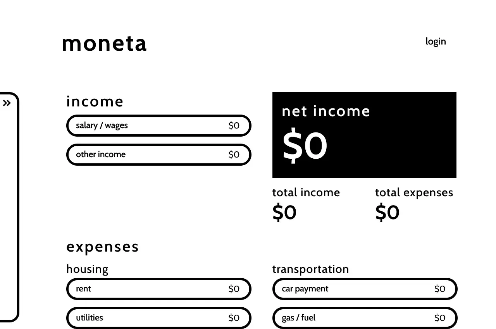

# Moneta - a budgetting app

## Table of contents

- [Overview](#overview)
  - [Screenshot](#screenshot)
  - [Links](#links)
- [My process](#my-process)
  - [Built with](#built-with)
  - [What I learned](#what-i-learned)
  - [Continued development](#continued-development)
- [Author](#author)

## Overview :ghost:

A minimalistic budgetting app with user authentication and persistent data. The user can enter in their monthly budget and the app will keep track of their total income and expenses. 

This app is a work in progress with many updates planned, so keep an eye out for new features!

### Screenshot

### Links

- [GitHub Repo](https://github.com/frances-m/budget-app)
- [Live Site](https://moneta-francesm.netlify.app/)

## My process

### Built with

- Firebase Realtime Database
- Firebase Auth
- React.js
- CSS

### What I learned

This was my first experience using Firebase! I've learned a ton about how to implement realtime databases and user authentication. Overall, I'm really proud of my implementation of these features and excited to continue delving deeper into these concepts.

### Continued development

- Allow users to create and remove inputs
- Allow users to create and remove categories
- Allow users to add and track multiple months
- Allow users to re-order inputs & categories
- Implement React Router
- Create seperate login page
- Create user account page

## Author

- [Portfolio Site](https://francesm.dev)
- [LinkedIn](https://www.linkedin.com/in/fr-ncesm/)